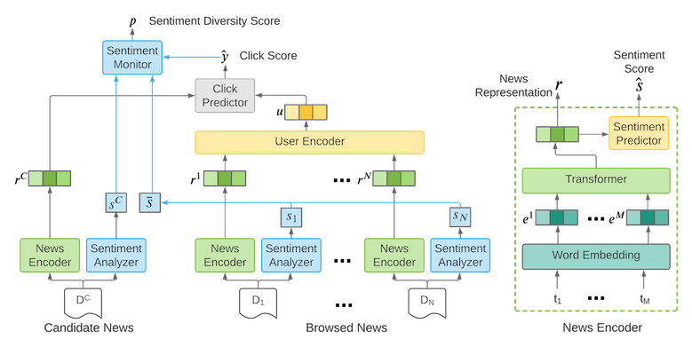
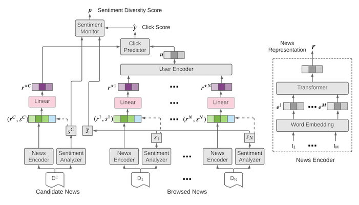

# NewsRec
Welcome 👋 to the repo of our paper:

**Diversifying Sentiments in News Recommendation** <br/>
Mete Sertkan, Sophia Althammer, Sebastian Hofstätter and Julia Neidhardt <br/>
[https://ceur-ws.org/Vol-3228/paper3.pdf](https://ceur-ws.org/Vol-3228/paper3.pdf)

tldr;  We aim to reproduce SentiRec [(Wu et al., 2020)](https://www.aclweb.org/anthology/2020.aacl-main.6.pdf), a sentiment diversity-aware news recommender that aims to counter the lack of sentiment-diversity in personalized news recommendations. We re-implemented the SentiRec model from scratch and used the Microsoft MIND dataset (ref) for training and evaluation. We have evaluated and discussed our reproduction from different perspectives. In addition to comparing the recommendation list to the user’s interaction history, as the original paper did, we also analyzed the intra-list sentiment diversity of the recommendation list. We also studied the effect of sentiment diversification on topical diversity. Our results suggest that SentiRec does not generalize well to other data sets and that the compared baselines already perform well.

Checkout [our paper](https://ceur-ws.org/Vol-3228/paper3.pdf) for more details, and please feel free to use our source code and let us know if you have any questions or feedback ([mete.sertkan@tuwien.ac.at](mailto:mete.sertkan@tuwien.ac.at) or dm to[@m_sertkan](https://twitter.com/m_sertkan)).

We call this repo, NewsRec, since we also provide all (re-implemented) baselines and an adapted version of SentiRec, i.e. RobustSentiRec, 🤗.
Currently our repository contains following models:
- [LSTUR (An et al., 2019)](https://www.aclweb.org/anthology/P19-1033/)
- [NAML (WU et al., 2019)](https://arxiv.org/abs/1907.05576)
- [NRMS (Wu et al., 2019)](https://www.aclweb.org/anthology/D19-1671/)
- [SentiRec (Wu et al., 2020)](#sentirec)
- [RobustSentiRec (Sertkan et al, 2022)](#robustsentirec)

**Please cite our work as:**
```
@inproceedings{sertkan2022diversifying,
	title        = {Diversifying Sentiments in News Recommendation},
	author       = {Sertkan, Mete and Althammer, Sophia and Hofst{\"a}tter, Sebastian and Neidhardt, Julia},
	year         = 2022,
	booktitle    = {Proceedings of the Perspectives on the Evaluation of Recommender Systems Workshop 2022 co-located with the 16th ACM Conference on Recommender Systems (RecSys 2022)}
}
```

## SentiRec


SentiRec builds upon the NRMS model and learns through an auxiliary sentiment-prediction task in the news encoding sentiment-aware news representations and in turn penalizes recommendations, which have a similar sentiment orientation as the user’s history track.

## RobustSentiRec


We adapt SentiRec by omitting the auxiliary sentiment-prediction task. Instead, we directly incorporate the sentiment-polarity scores determined by the sentiment-analyzer into the news representation by concatenating it with the output of the news encoder and applying a linear transformation.


# How to Train and Test
## Requirements
In our implementations we use the combo pytorch - pytorchlighnting - torchmetrics. Thus, a cuda device is suggested and more are even better! We are using conda and have exported the conda-environment we are working with, thus: 
1. Install [conda](https://docs.conda.io/en/latest/)
2. Create an environment with the provided environment.yml:

    ```
    conda env create -f environment.yml
    ```
3. Activate the environment as following: 
    ```
    conda activate newsrec
    ```
## Data
In our experiments we use the Microsoft News Dataset, i.e., MIND. In particular we have used MINDsmall_train in a 9:1 split for trainig and validation; and the MINDsmall_dev as our holdout. The datasets and more detail are provided [here](https://msnews.github.io/index.html). Furthermore, we use 300-dimensional Glove embeddings, which can be downloaded [here](http://nlp.stanford.edu/data/glove.840B.300d.zip). 

In order to train our models, you need to pre-preprocess the data. Therefore, we provide ``./project/data/parse_behavior.py`` and ``./project/data/parse_news.py``. 

Run the prepreocessing as following (or use ``project/data/prep.sh`` ;) ):
1. Download the MIND dataset and the Glove embeddings
2. Create two directories ``<train_dir>`` and ``<test_dir>``; one for training and for the testing data.
3. Preprocess the impression logs of the mind-trainig data as follows: 
```
python parse_behavior.py --in-file mind/train/behaviors.tsv --out-dir <train_dir> --mode train
```
4. Preprocess the impressions logs of the mind-test data as follows:
```
python parse_behavior.py --in-file mind/test/behaviors.tsv --out-dir <test_dir> --mode test --user2int <train_dir>/user2int.tsv 
```
5. Preprocess the news content of the mind-train data as follows:
```
python parse_news.py --in-file mind/train/news.tsv --out-dir <train_dir> --mode train --word-embeddings glove.840B.300d.txt
```
6. Preprocess the news content of the mind-test data as follows: 
```
python parse_news.py --in-file mind/test/news.tsv --out-dir <teset_dir> --mode test --word-embeddings glove.840B.300d.txt --embedding-weights <train_dir>/embedding_weights.csv  --word2int <train_dir>/word2int.tsv --category2int <train_dir>/category2int.tsv  
```


## Config
We provide for each model example configs under ``./project/config/model/_model_name_``. The config files contain general information, hyperparameter, meta-information (logging, checkpointing, ...). All hyperparemters are either trained on the validation set or referr to the corresponding papers. The generall structure of the config is as follwing: 

- GENERAL: General information about the model like the name of the model to be trained (e.g., ``name: "sentirec"``). 
- DATA: Paths to (pre-processed) train and test data files and information about the underlying data (might be changed according to the pre-processing); Features to be used in the model, e.g. title, vader_sentiment, distillbert_sst2_sentiment, etc. 
- MODEL: Hyperparams of the model and model-architecture, e.g., learning_rate, dropout_probability, num_attention_heads, sentiment_classifier, etc. 
- TRAIN: Config for the Checkpointing, Logging, Earlystop; Dataloader information (e.g., batch_size, num_workers ,etc.); and Config  for the trainer (e.g., max_epochs, fast_dev_run, etc.)

Please, change the config according to your needs. You may want to change the paths to: i) train/test - data; ii) directory for the checkpoints; iii) directory for the logging.

## Train-Run
You can train now the models using ``./project/train.py``. Here an example for running SentiRec: 
```
CUDA_VISIBLE_DEVICES=0,1 ./project/train.py --config ./project/config/model/sentirec/vader_lambda0p4_mu10.yaml
```
The name parameter in the config defines which model to train, here it is set to "sentirec". With ``CUDA_VISIBLE_DEVICES=ids`` you can define on which CUDA devices to train. If you do not define any device and run just ``./project/train.py`` all visible devices will be used. 

Currently ``train.py`` saves the last checkpoint and the one of best three epochs (can be configured) based on validation-AUC. In case of an interruption it attempts a gracefull shutdown and saves the checkpoint aswell. You can resume training by providing a path to a checkpoint with  ``--resume`` like: 
```
CUDA_VISIBLE_DEVICES=0,1 ./project/train.py --config ./project/config/model/sentirec/vader_lambda0p4_mu10.yaml --resume _path_to_checkpoint_
```

## Test-Run
For Testing use the same config as you have trained, since it contains all necessary information, e.g., path to test data, config of test-dataloader, logging info, etc. It may take longer, but use only ONE GPU for testing (e.g., ``CUDA_VISIBLE_DEVICES=_one_gpu_id_of_your_choice_``). Only test once, right before you report/submit (after validation, tuning, ...). You have to provide a checkpoint of your choice (e.g., best performing hyperparam setting according to val, etc.) and can run a test as following:
```
CUDA_VISIBLE_DEVICES=0 ./project/test.py --config project/config/model/sentirec/vader_lambda0p4_mu10.yaml --ckpt path_to_ckpt_of_your_choice
```

## Monitoring
We use the default logger of pytorchlightning, i.e., tensorboard. You can monitor your traning, validation, and testing via tensorboard. You have to provide the path of your logs and can start tensorboard as following: 
```
tensorboard --logdir _path_to_tensorboard_logdir_
```


# Acknowledgments
We build upon [Microsoft's recommenders repo](https://github.com/microsoft/recommenders). 

    
